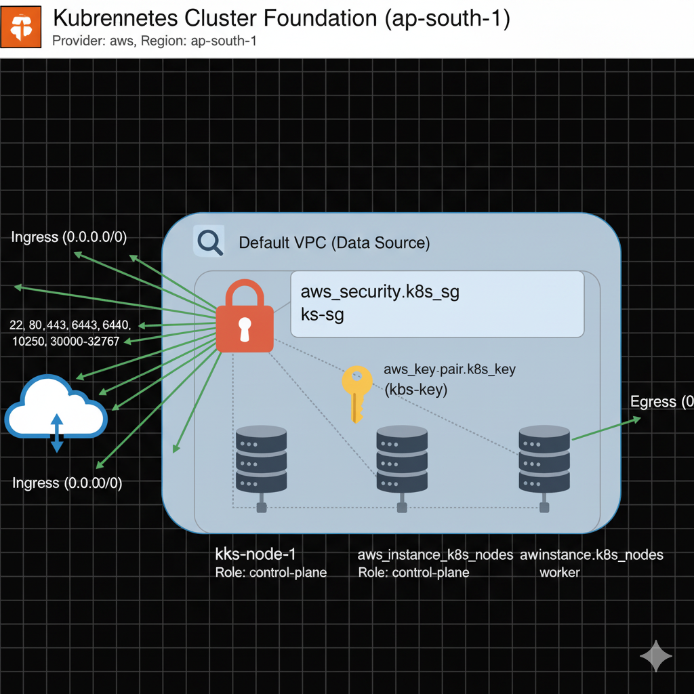
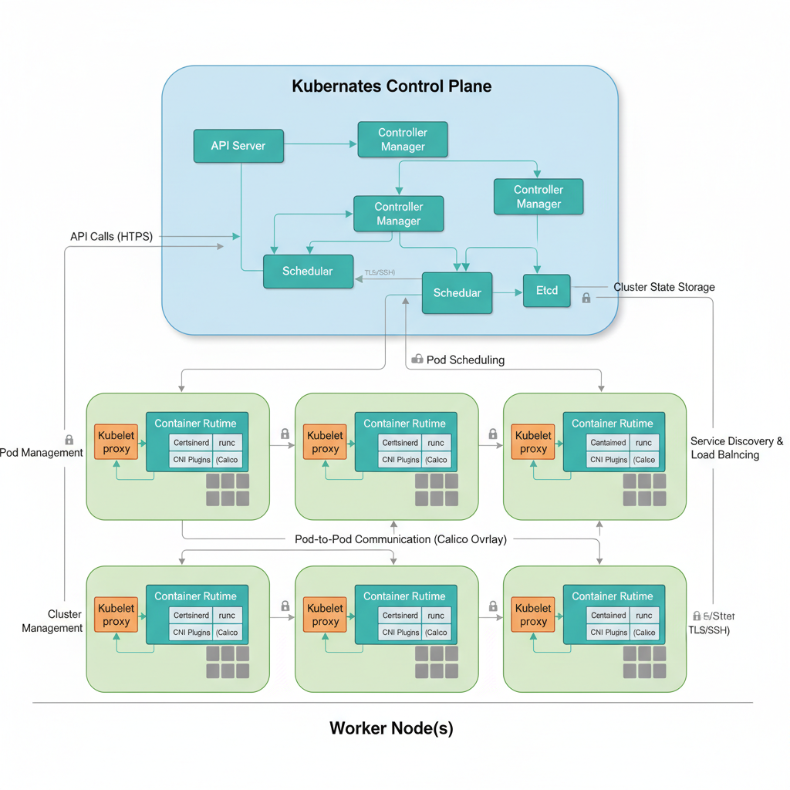

# 🚀 Kubernetes Cluster Setup using Terraform & kubeadm

This project automates and documents the setup of a **Kubernetes cluster** using **Terraform** and **kubeadm**.
It provisions **3 EC2 instances** (1 Master + 2 Worker nodes) and configures them into a functional cluster with **Calico networking**.

---

## 🧠 What is kubeadm?

**kubeadm** is a tool to bootstrap a Kubernetes cluster.
It installs and configures all **control plane components** — such as:

* **API Server**
* **ETCD**
* **Controller Manager**
* **Scheduler**

It also installs essential CLI tools like:

* `kubeadm`
* `kubelet`
* `kubectl`

---

## ⚙️ Infrastructure Setup with Terraform

### 🛡️ Security Group Configuration

| **SG Name**  | **Type**      | **Protocol** | **Port Range**    | **Source**                              | **Description**          |
|---------------|---------------|---------------|-------------------|------------------------------------------|---------------------------|
| master-sg     | SSH           | TCP           | 22                | Your IP                                 | Admin access              |
| master-sg     | K8s API       | TCP           | 6443              | master-sg, worker-sg, Your IP           | Kubernetes API Server     |
| master-sg     | etcd          | TCP           | 2379-2380         | master-sg                               | etcd server               |
| master-sg     | Calico BGP    | TCP           | 179               | master-sg, worker-sg                    | Calico networking         |
| worker-sg     | SSH           | TCP           | 22                | Your IP                                 | Admin access              |
| worker-sg     | NodePort      | TCP           | 30000-32767       | 0.0.0.0/0 (or restricted)               | Kubernetes NodePort range |
| worker-sg     | Calico BGP    | TCP           | 179               | master-sg, worker-sg                    | Calico networking         |

Using the provided `main.tf`, Terraform will:

* Provision **3 VMs**:

  * 1 Master node
  * 2 Worker nodes
* Create **2 Security Groups**:

  * One for the Master node
  * One shared by both Worker nodes
* Open all **Kubernetes-required ports** based on the [official Kubernetes documentation](https://kubernetes.io/docs/reference/ports-and-protocols/)

> 


---

## 🧩 Control Plane (Master Node) Configuration

### 1️⃣ SSH into the Master VM

```bash
ssh -i <your-key.pem> ubuntu@<master-public-ip>
```

---

### 2️⃣ Disable Swap

Kubernetes requires swap to be disabled:

```bash
sudo swapoff -a
sudo sed -i '/ swap / s/^\(.*\)$/#\1/g' /etc/fstab
```

---

### 3️⃣ Enable IPv4 Forwarding & Bridged Traffic

Run the **`bridgedtraffic.sh`** script.

#### What this script does:

* Loads necessary kernel modules (`br_netfilter`, `overlay`)
* Configures `sysctl` parameters for bridged networking
* Applies settings persistently and verifies them

Expected verification:

```bash
sysctl net.bridge.bridge-nf-call-iptables
sysctl net.ipv4.ip_forward
```

---

### 4️⃣ Install Container Runtime

Use the **`containerruntime.sh`** script to install and configure **containerd** as the container runtime.

---

### 5️⃣ Install runc

```bash
curl -LO https://github.com/opencontainers/runc/releases/download/v1.1.12/runc.amd64
sudo install -m 755 runc.amd64 /usr/local/sbin/runc
```

---

### 6️⃣ Install CNI Plugin

```bash
curl -LO https://github.com/containernetworking/plugins/releases/download/v1.5.0/cni-plugins-linux-amd64-v1.5.0.tgz
sudo mkdir -p /opt/cni/bin
sudo tar Cxzvf /opt/cni/bin cni-plugins-linux-amd64-v1.5.0.tgz
```

---

### 7️⃣ Install kubeadm, kubelet, and kubectl

Run the **`inskubeadm.sh`** script to install Kubernetes tools.

---

### 8️⃣ Configure crictl to Work with containerd

```bash
sudo crictl config runtime-endpoint unix:///var/run/containerd/containerd.sock
```

---

### 9️⃣ Initialize the Control Plane

```bash
sudo kubeadm init --pod-network-cidr=192.168.0.0/16 \
--apiserver-advertise-address=172.31.89.68 \
--node-name master
```

> ⚠️ **Important:**
> Copy the `kubeadm join` command generated at the end — it will be used later for Worker nodes.

---

### 🔑 Prepare kubeconfig

```bash
mkdir -p $HOME/.kube
sudo cp -i /etc/kubernetes/admin.conf $HOME/.kube/config
sudo chown $(id -u):$(id -g) $HOME/.kube/config
```

---

### 🌐 Install Calico Network Plugin

```bash
kubectl create -f https://raw.githubusercontent.com/projectcalico/calico/v3.28.0/manifests/tigera-operator.yaml
curl -O https://raw.githubusercontent.com/projectcalico/calico/v3.28.0/manifests/custom-resources.yaml
kubectl apply -f custom-resources.yaml
```

---

## 🧱 Worker Node Configuration

Perform **Steps 1–7** on both Worker EC2 instances.

Then, run the **join command** (copied earlier from the Master node):

```bash
sudo kubeadm join 172.31.71.210:6443 --token <token> \
--discovery-token-ca-cert-hash sha256:<hash>
```

> 💡 If you lost the command:
>
> ```bash
> kubeadm token create --print-join-command
> ```

---

## ✅ Validation

### Check Node Status:

```bash
kubectl get nodes
```

Expected output:

```
NAME      STATUS   ROLES           AGE     VERSION
master    Ready    control-plane   5m      v1.30.x
worker1   Ready    <none>          2m      v1.30.x
worker2   Ready    <none>          2m      v1.30.x
```

### Check Pods:

```bash
kubectl get pods -A
```

---

## 🩹 Troubleshooting (Calico Issues)

If Calico pods are not healthy:

1. **Disable Source/Destination Checks** on all EC2s (Master + Workers).

2. Ensure Security Group allows **TCP port 179** (Bidirectional, for BGP).

3. Update Calico DaemonSet:

   ```bash
   kubectl set env daemonset/calico-node -n calico-system \
   IP_AUTODETECTION_METHOD=interface=ens5
   ```

   *(Replace `ens5` with your instance’s default interface — verify via `ifconfig`.)*

4. Wait a few minutes, or restart Calico pods:

   ```bash
   kubectl delete pod -l k8s-app=calico-node -n calico-system
   ```

> 🩺 If the issue persists, use the **legacy Calico manifest** instead:
>
> ```bash
> kubectl apply -f https://docs.projectcalico.org/manifests/calico.yaml
> ```

---

## 📁 Project Structure

| Diagram                               | Description                                  | Placement                  |
| ------------------------------------- | -------------------------------------------- | -------------------------- |
| 🧱 **Terraform Infra Diagram**        | Shows 1 master + 2 workers, SGs, and subnets | After Terraform section    |
| 🔄 **Cluster Communication Flow**     | Control Plane ↔ Worker nodes ↔ Pods          | After Worker join step     |
| ⚙️ **Setup Pipeline**                 | Terraform → SSH → kubeadm → Calico           | At the end of README       |
| 🌐 **Calico Network Flow (Optional)** | Visualize pod-to-pod communication           | In Troubleshooting section |


```
.
├── terraform/
│   ├── main.tf
│   └── variables.tf
├── scripts/
│   ├── bridgedtraffic.sh
│   ├── containerruntime.sh
│   └── inskubeadm.sh
├── docs/
│   └── screenshots/
├── README.md
```

---

## 🧠 Key Learnings

* Terraform for automated EC2 + networking setup
* kubeadm for Kubernetes bootstrapping
* Manual runtime and CNI configuration for full visibility
* Calico troubleshooting and networking understanding

---

> 


---

### ✨ Author

**Aditya Kapse** — DevOps & Kubernetes Enthusiast
📘 Linkdin: www.linkedin.com/in/aditya-kapse-ba8aaa209 
🐙 GitHub: aditya6543


---

*This guide aims to serve as both a learning journey and a production-ready reference for deploying a Kubernetes cluster on AWS using Terraform and kubeadm.*
