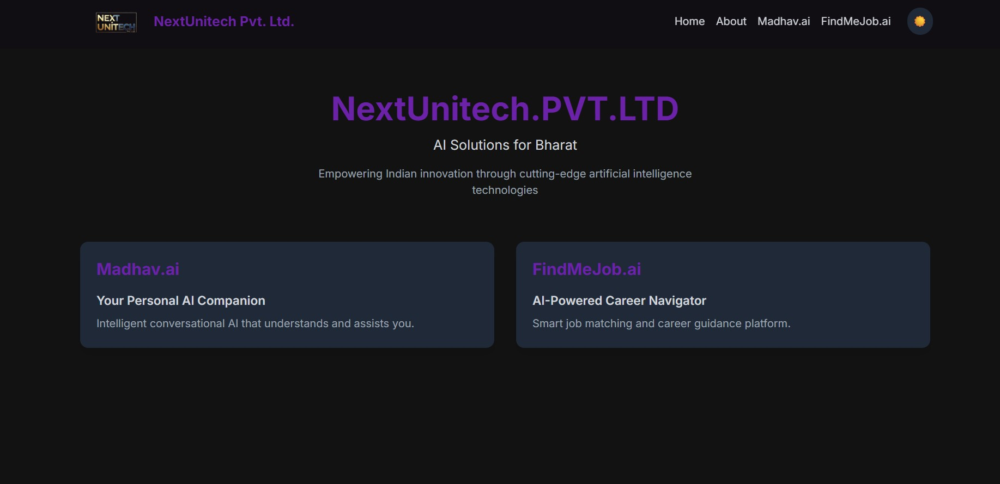
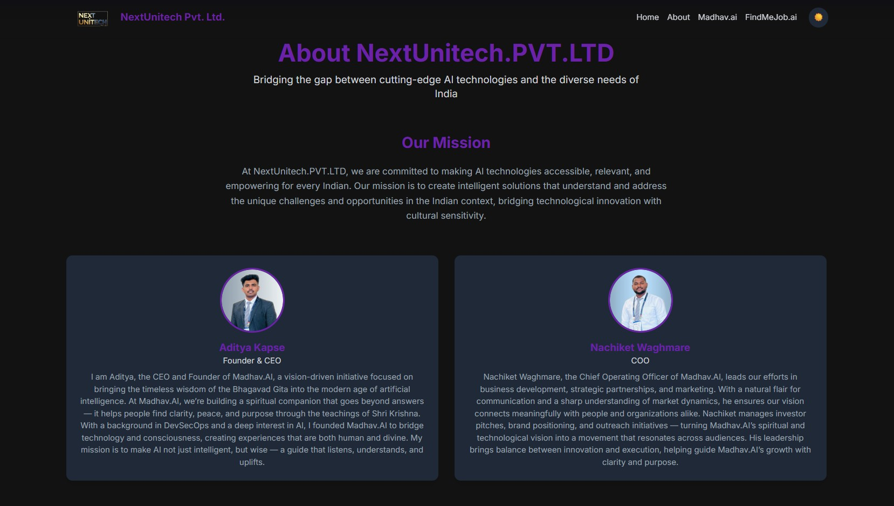
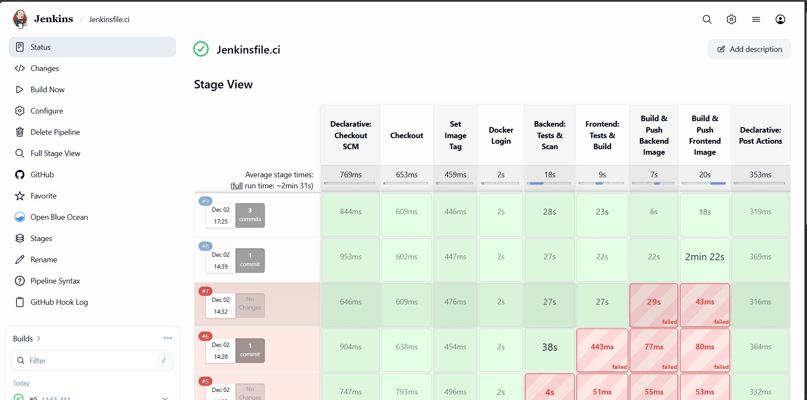
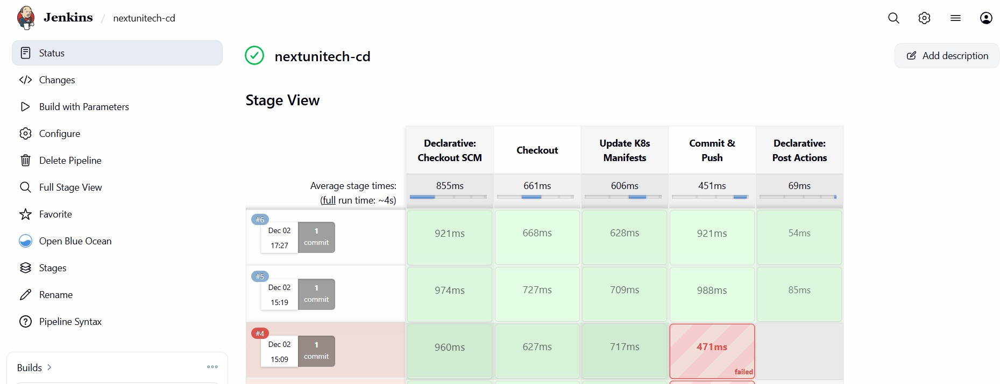
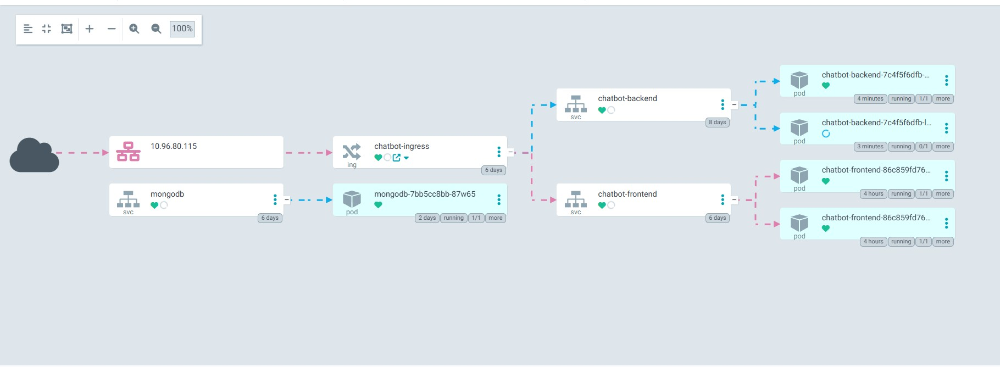
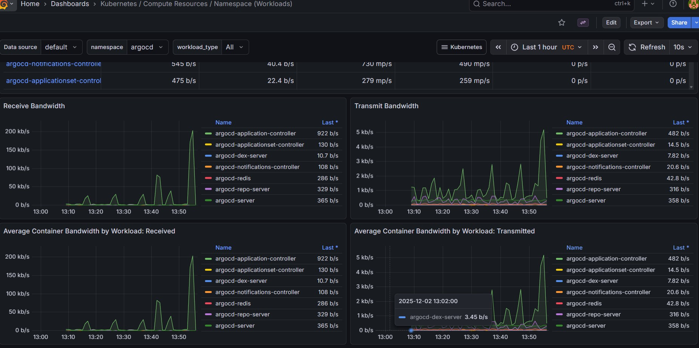

NextUnitech AI Platform

           

Enterprise-Grade DevSecOps Blueprint for a Full-Stack AI Application on AWS & Kubernetes

Short Executive Summary

The NextUnitech AI Platform is a production-grade, end-to-end DevSecOps reference implementation for a full-stack AI application built with React, FastAPI, and MongoDB, deployed on a self-managed Kubernetes cluster on AWS.
It demonstrates how to design and operate a secure, observable, and automated platform using Terraform, Jenkins, ArgoCD, Prometheus, Grafana, and AWS Secrets Manager.
The repository is structured to showcase real-world Platform Engineering practices, including shift-left security, GitOps delivery, immutable infrastructure, and enterprise-ready documentation.
This project is ideal for recruiters evaluating DevOps skills, developers learning modern cloud-native patterns, and engineers who want to fork, extend, and deploy a realistic platform.

Preview Screenshots

| Screenshot | Description |
|-----------|-------------|
|  | **Home UI Screenshot** |
|  | **Application Operational View** |
|  | **CI (Jenkins) Pipeline Execution** |
|  | **CD Pipeline Updating Kubernetes Manifests** |
|  | **ArgoCD GitOps Deployment View** |
|  | **Monitoring Dashboard (Grafana)** |
Feature Highlights

End-to-End DevSecOps Platform
Complete lifecycle from code commit → CI (build/test/scan) → containerization → GitOps-based CD → monitoring and feedback.

Infrastructure as Code with Terraform

Custom VPC, subnets, route tables, and security groups.

EC2 instances for Kubernetes master and workers.

Application Load Balancer (ALB) with Route53 integration and TLS termination using AWS ACM.

Self-Managed Kubernetes Cluster (kubeadm)

One control-plane node and multiple worker nodes.

Cluster bootstrapped via kubeadm for full control and learning.

Calico CNI for networking, NGINX Ingress for traffic routing.

Production-Ready Application Stack

Frontend: React + Vite + Tailwind + modern UI patterns.

Backend: FastAPI with async I/O, OpenAI integration, and MongoDB access.

Database: MongoDB for chat history and user data persistence.

Shift-Left Security / DevSecOps

Gitleaks: Prevents hardcoded secrets from entering the repository.

Trivy: Filesystem and image vulnerability scanning.

SonarQube: Static code analysis, code smells, coverage, and quality gates.

OWASP Dependency-Check: Detects vulnerable third-party dependencies.

GitOps Delivery with ArgoCD

Kubernetes manifests stored in Git as the single source of truth.

ArgoCD continuously reconciles the desired state from Git to the cluster.

Automatic drift detection and declarative rollbacks.

Secure Secret Management

No secrets committed to Git.

AWS Secrets Manager as the central secret store.

External Secrets Operator (ESO) to sync secrets into Kubernetes.

Observability & Operations

Prometheus for metrics scraping and alerting.

Grafana with curated dashboards for cluster, node, pod, and application metrics.

Foundation for SRE-style SLIs/SLOs and alert-based operations.

System Architecture (Mermaid Diagram)
graph TD
    User[User / Client] -->|HTTPS/443| DNS[Route53 (DNS)]
    DNS --> ALB[Application Load Balancer]
    ALB --> TG[Target Group (NodePort 30080)]

    subgraph AWS_Cloud[AWS Cloud (ap-south-1)]
        subgraph K8sCluster[Kubernetes Cluster (EC2 Nodes)]
            TG --> Ingress[NGINX Ingress Controller]

            Ingress -->|/| Frontend[Frontend Pod (React App)]
            Ingress -->|/api| Backend[Backend Pod (FastAPI API)]

            Backend --> MongoDB[MongoDB Pod / StatefulSet]
            Backend --> ESO[External Secrets Operator]
        end

        ESO --> SecretsManager[AWS Secrets Manager]
    end

    Backend --> OpenAI[OpenAI API]

DevSecOps Pipeline Architecture (Mermaid Diagram)
graph LR
    Dev[Developer] -->|Push Code| Git[GitHub Repository]
    Git -->|Webhook| Jenkins[Jenkins CI Server]

    subgraph CI[Continuous Integration]
        Jenkins --> Checkout[Checkout Source Code]
        Checkout --> Tests[Unit & API Tests (Jest / Pytest)]
        Tests --> SecurityScans[Security & Quality Scans]

        subgraph SecStage[Security Stage]
            SecurityScans --> Trivy[Trivy Filesystem & Image Scan]
            SecurityScans --> Gitleaks[Gitleaks Secret Detection]
            SecurityScans --> Sonar[SonarQube Code Quality & SAST]
            SecurityScans --> OWASP[OWASP Dependency-Check]
        end

        SecStage --> DockerBuild[Build & Tag Docker Images]
        DockerBuild --> Registry[DockerHub / Container Registry]
        DockerBuild --> ManifestUpdate[Update K8s Manifests (deploy/k8s)]
    end

    ManifestUpdate --> GitOpsRepo[GitOps Manifests Repository]

    subgraph CD[Continuous Delivery (GitOps)]
        GitOpsRepo --> ArgoCD[ArgoCD Controller]
        ArgoCD --> Cluster[Kubernetes Cluster]
    end

Technology Stack Table
Domain	Tooling / Services	Purpose
Cloud Provider	AWS (EC2, VPC, Route53, ALB, ACM, IAM, Secrets Manager)	Compute, networking, SSL, DNS, identity, secrets
Infrastructure as Code	Terraform	Provision VPC, subnets, EC2 nodes, ALB, security groups
Container Runtime	containerd	Lightweight, CRI-compliant container runtime
Orchestration	Kubernetes (kubeadm cluster)	Pod scheduling, scaling, service abstraction
CI System	Jenkins	Declarative pipelines for build, test, scan, and packaging
CD / GitOps	ArgoCD	Declarative sync of K8s manifests from Git
Security / DevSecOps	Trivy, Gitleaks, SonarQube, OWASP Dependency-Check	Vulnerability scanning, secret detection, SAST, dependency scanning
Monitoring	Prometheus, Alertmanager	Metrics collection and alerting
Visualization	Grafana	Dashboarding for cluster and app-level observability
Secret Management	AWS Secrets Manager + External Secrets Operator	Secure secret storage and sync into K8s
Frontend	React, Vite, Tailwind CSS, (optionally Framer Motion)	SPA UI, landing page, dashboard
Backend	FastAPI (Python), Uvicorn/Gunicorn	High-performance async API, business logic
Database	MongoDB	NoSQL store for chats, configuration, user data
Container Registry	DockerHub (or compatible registry)	Storage for versioned container images
Prerequisites

Before you clone or deploy this project, ensure the following are available:

Accounts & Cloud Resources

AWS Account with permissions to:

Create VPC, subnets, security groups, and route tables.

Launch EC2 instances (for Kubernetes master and workers).

Create and manage ALB and Target Groups.

Manage IAM roles and instance profiles.

Use Secrets Manager for storing application secrets.

Registered Domain Name managed in Route53 (for HTTPS + Ingress routing).

DockerHub (or container registry) account to push application images.

OpenAI API Key for AI functionality in the backend.

Local Tooling

Terraform: v1.5+

AWS CLI: v2, configured via aws configure

kubectl: Latest stable version

Docker Engine / Docker Desktop: Latest version

Helm: Latest version

Git

Optional (for local analysis):

SonarQube (Docker-based)

OWASP Dependency-Check CLI or Docker image

Local Setup

This section walks through running the full application locally and executing core security tools prior to any cloud deployment.

1. Clone the Repository
git clone https://github.com/aditya6543/nextunitech.git
cd nextunitech

2. Configure Environment Variables

Within the repository you will find .env.example files for both the frontend and backend (check under fastapi_backend and Frontend/Front-end as applicable).

Copy the example files:

cp fastapi_backend/.env.example fastapi_backend/.env
cp frontend/.env.example frontend/.env   # adjust folder name if needed

Open each .env file and set:

MONGODB_URI (for local dev: mongodb://localhost:27017)

OPENAI_API_KEY

Any app-specific secrets or configuration keys.

These files are local-only and are not meant for production secret management (production uses AWS Secrets Manager + ESO).

3. Running SonarQube (Code Quality & SAST)

You can run SonarQube locally via Docker:

docker run -d --name sonarqube \
  -p 9000:9000 \
  sonarqube:lts

Then:

Open SonarQube in your browser: http://localhost:9000

Log in with default credentials: admin / admin

Change the password on first login.

Create a new project and generate a project token.

From the repo root, run the scanner (example for a generic project):

# Example: using sonar-scanner CLI (must be installed locally)
sonar-scanner \
  -Dsonar.projectKey=nextunitech \
  -Dsonar.sources=. \
  -Dsonar.host.url=http://localhost:9000 \
  -Dsonar.login=<YOUR_PROJECT_TOKEN>

SonarQube will analyze code quality, security hotspots, and code coverage (if integrated with test reports).

4. Running Gitleaks (Secret Detection)

Before committing or pushing, run Gitleaks to ensure no secrets are accidentally checked in:

docker run --rm -v "$PWD:/repo" zricethezav/gitleaks:latest \
  detect --source="/repo" -v

If any hardcoded secrets are detected, Gitleaks will fail with details.

Fix or remove secrets before continuing.

5. Running Trivy (Filesystem & Image Vulnerability Scans)
Filesystem Scan (Source-Level Dependencies)

From the repository root:

trivy fs .

This will scan for:

Vulnerable dependencies (requirements.txt, package.json, etc.)

Misconfigurations in Dockerfiles or IaC (depending on Trivy version/config).

Image Scan (After Building Images)

Once Docker images are built (for example via docker-compose or CI):

trivy image your-docker-username/nextunitech-frontend:local
trivy image your-docker-username/nextunitech-backend:local

Resolve HIGH and CRITICAL vulnerabilities where possible.

6. Running OWASP Dependency-Check

You can run OWASP Dependency-Check using Docker (recommended):

docker run --rm \
  -v "$PWD:/src" \
  -v "$PWD/odc-data:/usr/share/dependency-check/data" \
  -v "$PWD/odc-report:/report" \
  owasp/dependency-check:latest \
  --scan /src \
  --format "HTML" \
  --out /report

Open the generated HTML report in odc-report to inspect vulnerable libraries and CVEs.

7. Running the Application Locally (Docker Compose)

The repository includes a docker-compose setup to run frontend, backend, and MongoDB locally.

From the project root:

docker-compose up --build

Once containers are up:

Component	URL
Frontend (React)	http://localhost:3000

Backend (FastAPI docs)	http://localhost:8000/docs

MongoDB	mongodb://localhost:27017 (internal to Docker network or mapped port if configured)

Use this environment to validate:

Application workflows.

API endpoints and OpenAPI documentation.

Integration with OpenAI (if you provide a valid API key).

AWS Infrastructure Deployment (Terraform)

All cloud infrastructure is provisioned via Terraform under the Infrastructure/terraform directory.

1. Initialize Terraform
cd Infrastructure/terraform
terraform init

This:

Downloads required providers (AWS, etc.).

Prepares the working directory for planning and applying.

2. Review the Execution Plan
terraform plan

Review and confirm it will create:

VPC with appropriate CIDR (e.g., 10.0.0.0/16).

Public and private subnets across availability zones.

Internet Gateway and NAT Gateway (if configured).

Route tables mapped to subnets.

Security groups for:

SSH (restricted to your IP).

Node-to-node communication.

ALB-to-node NodePort access.

EC2 instances:

k8s-master (control plane).

k8s-node-1, k8s-node-2 (worker nodes).

Application Load Balancer:

Listener on port 443.

Target group forwarding to node NodePort (e.g., 30080).

IAM roles and instance profiles:

Permissions for node access to AWS APIs.

Permissions for External Secrets Operator to read from Secrets Manager.

3. Apply Terraform Configuration
terraform apply --auto-approve

This step:

Provisions EC2 nodes in the chosen region (e.g., ap-south-1).

Configures networking, routing, and security groups.

Associates the ALB with the configured subnets.

Optionally attaches a Route53 DNS record (A / CNAME) to the ALB.

Note: This environment incurs real AWS costs while running (EC2, ALB, NAT, etc.). See the Cleanup Guide section for teardown.

Kubernetes Bootstrap Guide (Self-Managed Cluster)

Once EC2 instances are provisioned, you will bootstrap Kubernetes manually (or via provided scripts) to understand the full lifecycle.

1. SSH into the Master Node
ssh -i <your-key.pem> ec2-user@<master-node-public-ip>
cd /path/to/scripts  # e.g., Infrastructure/scripts

2. Configure Networking & Kernel Modules

Run:

./bridgedtraffic.sh

This typically:

Enables net.bridge.bridge-nf-call-iptables and net.ipv4.ip_forward.

Ensures bridged traffic is properly processed by iptables for Kubernetes networking.

3. Install Container Runtime (containerd)
./containerruntime.sh

This script:

Installs and configures containerd as the CRI.

Sets systemd cgroups where required.

Enables and starts the containerd service.

4. Install kubeadm, kubelet, kubectl
./inskubeadm.sh

This will:

Add the Kubernetes APT or YUM repository (depending on AMI).

Install kubeadm, kubelet, and kubectl.

Enable kubelet as a systemd service (will show “NotReady” until cluster is initialized).

5. Initialize the Control Plane

On the master node:

sudo kubeadm init \
  --pod-network-cidr=192.168.0.0/16 \
  --node-name master

Notes:

--pod-network-cidr is aligned with Calico (192.168.0.0/16).

Command output will include a kubeadm join ... line: save this for your worker nodes.

Configure local kubeconfig (for the ec2-user or ubuntu user):

mkdir -p $HOME/.kube
sudo cp /etc/kubernetes/admin.conf $HOME/.kube/config
sudo chown $(id -u):$(id -g) $HOME/.kube/config

Validate:

kubectl get nodes

The master should be in Ready or NotReady (until CNI is installed).

6. Install CNI Plugin (Calico)

From the master node:

kubectl apply -f https://raw.githubusercontent.com/projectcalico/calico/v3.28.0/manifests/calico.yaml

Wait a few moments, then verify:

kubectl get pods -n kube-system
kubectl get nodes

Nodes should now report Ready if networking is healthy.

7. Join Worker Nodes

For each worker node:

SSH into the worker EC2 instance.

Run the same scripts as above for container runtime and kube binaries (if not baked into AMI).

Use the kubeadm join command from the master initialization output, for example:

sudo kubeadm join <master-private-ip>:6443 \
  --token <token> \
  --discovery-token-ca-cert-hash sha256:<hash>

Once joined:

kubectl get nodes

You should see master, k8s-node-1, k8s-node-2 all in Ready state.

8. Install Ingress Controller (NGINX)

On the master:

kubectl apply -f \
  https://raw.githubusercontent.com/kubernetes/ingress-nginx/controller-v1.8.2/deploy/static/provider/baremetal/deploy.yaml

Validate:

kubectl get pods -n ingress-nginx
kubectl get svc -n ingress-nginx

The ingress controller will be fronted by the ALB (via NodePort / target group).

9. Configure Storage Class (Optional but Recommended)

If using EBS-backed storage:

Install a suitable CSI driver (e.g., aws-ebs-csi-driver).

Define a StorageClass with provisioner set to the CSI driver.

Ensure MongoDB or any stateful workloads use a PersistentVolumeClaim bound to this storage class.

Secrets Management With AWS + External Secrets Operator

The platform never stores production secrets in Git.

1. Create Secrets in AWS Secrets Manager

In AWS Secrets Manager, create a secret such as:

Name: nextunitech/production/config
Key-Value Pairs:

MONGODB_URI

OPENAI_API_KEY

SESSION_SECRET

Any other sensitive configuration (e.g., third-party API keys).

2. Install External Secrets Operator (ESO)

On your Kubernetes cluster:

helm repo add external-secrets https://charts.external-secrets.io
helm repo update

helm install external-secrets external-secrets/external-secrets \
  -n external-secrets --create-namespace

3. Configure SecretStore and ExternalSecret

The repo includes Kubernetes manifests under deploy/k8s, for example:

secretstore.yaml – Defines how ESO should talk to AWS Secrets Manager (including region, auth via IAM role, etc.).

externalsecret.yaml – Maps a specific AWS secret (e.g., nextunitech/production/config) into a Kubernetes Secret.

Apply them:

kubectl apply -f deploy/k8s/secretstore.yaml
kubectl apply -f deploy/k8s/externalsecret.yaml

Verify:

kubectl get externalsecrets -A
kubectl get secrets -n <your-app-namespace>

You should see a K8s Secret generated by ESO with the keys used by your FastAPI backend and other services.

CI/CD (Jenkins + Docker + GitOps + ArgoCD)

The project uses a split CI/CD model:

CI (Jenkins) focuses on:

Code checkout

Tests

Security scans

Docker image build and push

Updating Kubernetes manifests

CD (ArgoCD) focuses on:

Syncing the cluster with the Git-hosted manifests

Monitoring deployment health

Rollbacks and drift management

1. Jenkins CI Pipeline

The Jenkinsfile.ci (or similarly named file) defines:

Checkout Stage

Pulls the latest commit from GitHub.

Build & Test Stage

Runs frontend tests (e.g., npm test, pnpm test, or vitest).

Runs backend tests via pytest.

Security Stage

Gitleaks: Scans for secrets.

Trivy: Scans source and Dockerfiles.

SonarQube: Sends metrics and quality data.

OWASP Dependency-Check: Identifies vulnerable libraries.

Docker Build & Push Stage

Builds images such as:

frontend:COMMIT_SHA

backend:COMMIT_SHA

Tags with commit hash and optionally with latest.

Pushes to DockerHub (credentials stored securely in Jenkins).

Manifest Update Stage

Updates image: tags in Kubernetes manifests under deploy/k8s/.

Commits and pushes those manifest changes back to the GitOps repository.

The screenshot ci.jpg visually captures a successful CI run, including all major stages.

2. GitOps and ArgoCD

The Git repository (or a dedicated manifests repo) is configured as an ArgoCD Application.

ArgoCD is responsible for:

Watching the Git repo for changes to:

frontend.yaml

backend.yaml

ingress.yaml

secrets, configmaps, etc.

Updating the cluster to match Git’s desired state.

Marking the app as Synced / OutOfSync.

Use the ArgoCD UI (see agrocd.jpg) to:

View application health and sync status.

Trigger manual syncs.

Inspect rollout history.

Perform rollbacks if necessary.

Monitoring & Observability

The platform uses Prometheus + Grafana for a production-style observability stack.

1. Install Kube-Prometheus Stack
helm repo add prometheus-community https://prometheus-community.github.io/helm-charts
helm repo update

helm install prometheus prometheus-community/kube-prometheus-stack \
  -n monitoring --create-namespace

This installs:

Prometheus

Alertmanager

Node exporter

Kube-state-metrics

Grafana

2. Access Grafana

Forward Grafana’s service locally:

kubectl port-forward svc/prometheus-grafana 3000:80 -n monitoring

Open http://localhost:3000 in your browser.

Default credentials:

Username: admin

Password: prom-operator

The screenshot grafana.jpg shows an example Kubernetes dashboard with node, pod, and cluster metrics.

3. Import Dashboards

In Grafana:

Go to Dashboards → Import.

Either:

Paste a Grafana.com dashboard ID (e.g., for Kubernetes / Prometheus), or

Upload a JSON dashboard file if you maintain one in this repo.

Select the Prometheus data source and click Import.

This gives you an instant view of:

Node CPU / memory.

Pod status, restarts, and resource usage.

Namespace-level insights and cluster health.

4. Alerts (High-Level)

With kube-prometheus-stack:

Alertmanager is preconfigured with several default alerts:

High CPU usage.

High memory usage.

Node not ready.

Pod crash loop backoff.

You can customize alert rules using PrometheusRule CRDs and integrate Alertmanager with:

Email

Slack

PagerDuty

Other Webhook receivers

This provides a foundation for SRE-style alerting on symptoms, not just raw metrics.

Validation & Troubleshooting Checklist

Use the following table to quickly diagnose common issues after deployment:

Symptom	Possible Cause	Diagnostic Commands	Suggested Fix
Pods stuck in Pending	CNI plugin not installed / misconfigured	kubectl get pods -A / kubectl describe pod	Re-apply Calico; ensure pod CIDR matches kubeadm init params.
Nodes show NotReady	Kubelet / networking issues	kubectl get nodes, journalctl -u kubelet	Check container runtime config, restart kubelet, verify IP and DNS.
Ingress returns 404 or no response	NGINX Ingress not running or wrong rules	kubectl get ingress -A, kubectl get pods -n ingress-nginx	Ensure ingress controller is running; verify host/path in Ingress manifests.
Secrets not present in pod	ESO cannot read AWS Secrets Manager	kubectl get externalsecrets -A, kubectl describe externalsecret	Check IAM role permissions; ensure secret name and region match; inspect ESO logs.
Jenkins build fails on security stage	Gitleaks / Trivy / OWASP / SonarQube failures	Review Jenkins logs and reports	Remove hardcoded secrets, update dependencies, patch vulnerabilities, or configure quality gates appropriately.
ArgoCD shows OutOfSync	Git manifests differ from cluster state	ArgoCD UI, argocd app diff	Click Sync or resolve manual changes in cluster and re-apply from Git.
ArgoCD cannot access repo	Invalid Git credentials or URL	ArgoCD UI → Settings → Repositories	Update token/SSH key for Git access, verify correct URL.
Grafana shows no data	Prometheus not scraping properly	kubectl get pods -n monitoring, inspect Prometheus targets	Check Prometheus scrape configs; ensure services and endpoints are discoverable.
ALB shows unhealthy targets	NodePort service misconfigured	AWS Console (ALB Target Groups), kubectl get svc -A	Ensure NodePort for ingress is open in SG; verify health check path and port.
Cleanup Guide (Destroy Instructions + Cost Warning)

⚠ Cost Warning:
The deployed stack uses multiple EC2 instances, a Kubernetes control plane, an Application Load Balancer, and supporting services. These incur ongoing hourly charges on AWS. Always tear down environments when not in use.

1. Delete Kubernetes Workloads (Optional)

You may first clean up workloads:

kubectl delete ns monitoring external-secrets
kubectl delete -f deploy/k8s/

2. Destroy Terraform Infrastructure

From the Terraform directory:

cd Infrastructure/terraform
terraform destroy --auto-approve

This will:

Terminate EC2 instances (master + workers).

Delete ALB, target groups, and associated resources.

Remove subnets, route tables, and VPC.

Clean up IAM roles and instance profiles (as configured in Terraform).

3. Verify in AWS Console

After terraform destroy completes:

Ensure all EC2 instances are terminated.

Verify ALB, target groups, and security groups are removed.

Confirm there are no leftover EBS volumes or orphaned Elastic IPs.

Roadmap

Planned enhancements for future iterations:

 Istio Service Mesh

mTLS between services.

Advanced traffic management (canary, A/B testing, traffic mirroring).

 High Availability Control Plane

Multi-master Kubernetes setup.

Spread across multiple availability zones.

 Centralized Logging via ELK Stack (Elasticsearch / Logstash / Kibana)

Unified logs for cluster and applications.

Searchable and indexed log data for troubleshooting and audit trails.

 Chaos Engineering with LitmusChaos

Inject pod, node, network, and infrastructure failures.

Validate system resilience and recovery behavior.

 SLOs & Error Budgets

Define SLIs (latency, error rate) and SLOs.

Integrate alerting with operational policies.

Contribution Guidelines

Contributions, improvements, and forks are welcome.

Fork the repository on GitHub.

Create a feature branch:

git checkout -b feature/YourAmazingFeature

Make changes with clean commit messages:

git commit -m "Add YourAmazingFeature"

Push your branch:

git push origin feature/YourAmazingFeature

Open a Pull Request against the main branch with:

A clear description of the change.

Any screenshots or logs (if relevant).

Notes on testing performed.

Please respect the non-commercial license when contributing or forking.

License Section

This project is licensed under:

Creative Commons Attribution–NonCommercial 4.0 International (CC BY-NC 4.0)

You are allowed to:

Use this repository for personal learning, portfolio projects, and experimentation.

Fork and modify the codebase for non-commercial purposes, including demos and study material.

Share and adapt the content as long as proper attribution is given to the original author: Aditya Kapse.

You are not permitted to:

Sell this project or any derivative as a commercial product.

Use it as the backend of a paid SaaS, commercial platform, or monetized hosting service.

Include it as part of paid courses, training bootcamps, or commercial consulting packages without explicit permission.

For full legal details, see the CC BY-NC 4.0 license text.

Call to Action

If this project helped you understand DevOps / DevSecOps / Kubernetes / Terraform / GitOps:

⭐ Star this repository to support the work.

🍴 Fork it, experiment, and deploy your own variant on AWS.

🚀 Showcase your deployment on LinkedIn and other platforms.

🔗 Tag the original author (Aditya Kapse) when you share your learnings, screenshots, or case studies.

Build, break, learn, and iterate—this repository is your playground for real-world, production-style DevSecOps engineering.